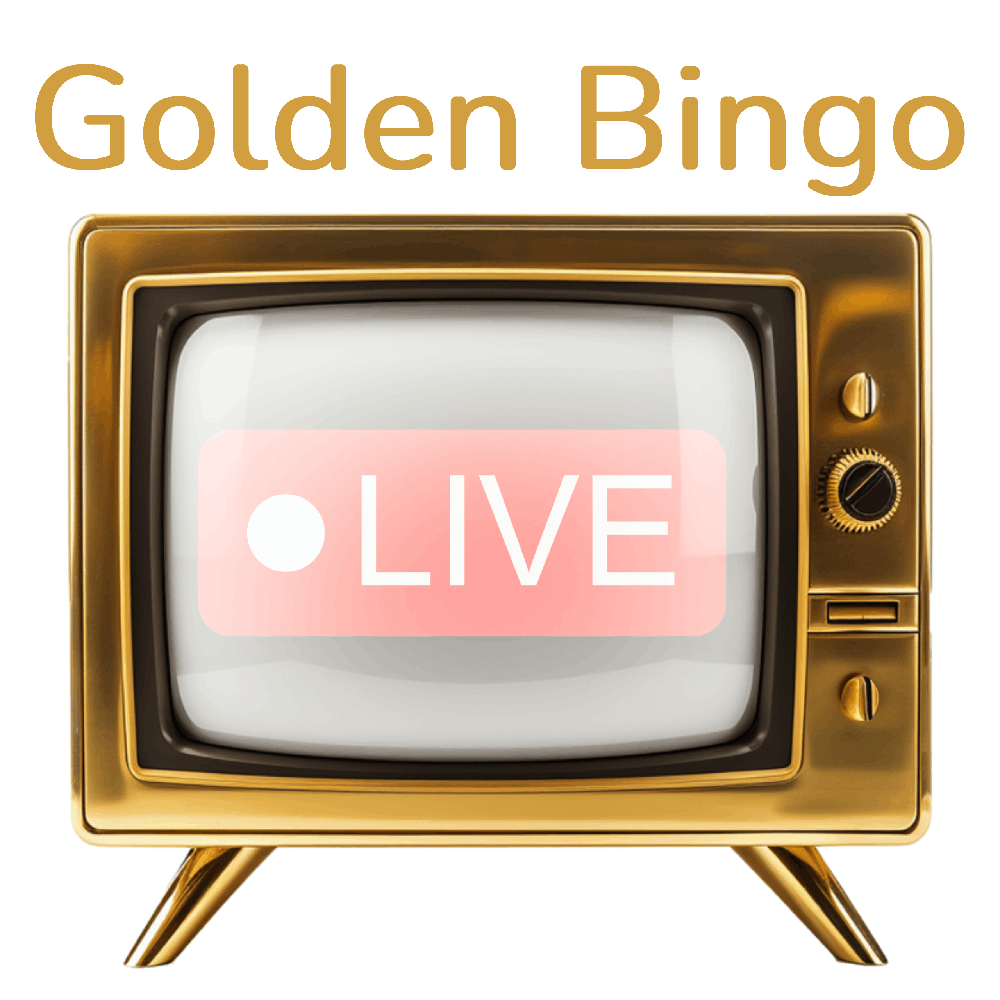

# GoldenBingo Live 🎱  
**Accessible Hybrid Bingo for Care Homes | Bridging Physical Play & Digital Community**

  
*"Where Every Daub Sparks Joy."*

---

## 🌟 Overview  
GoldenBingo Live is a **hosted online bingo service** designed exclusively for elderly care communities. It blends tactile physical cards with livestreamed games, enabling residents to enjoy the nostalgia of bingo while care staff manage gameplay seamlessly via QR scanning and auto-daubing.

---

## ✨ Key Features  

### 🎮 Elder-Centric Design  
- **TV-Optimized Interface**: Giant numbers, high-contrast colors, and closed captions.  
- **Physical Cards**: Printable large-print PDFs with scannable winner verification.  
- **Live Host Sessions**: Daily games with upbeat hosts and adjustable audio pacing.  

### 🛠️ Care Home Tools  
- **QR Winner Validation**: Scan winning cards instantly to confirm results.  
- **Print-on-Demand**: Order pre-printed cards shipped to your facility.  
- **Game Archive**: Revisit past games for reminiscence therapy activities.  

### 🔒 Compliance & Safety  
- **No Gambling**: Purely recreational (non-monetary prizes).  
- **GDPR-Compliant**: Zero personal data collection from residents.  
- **WCAG 2.1 AA**: Certified accessible for low-vision and hearing-impaired users.  

---

## 🏗️ Technical Architecture  
- **Frontend**: React.js (TV-first responsive UI), WebSocket real-time updates  
- **Backend**: Node.js/Express.js, MongoDB (game history), AWS EC2 hosting  
- **QR System**: UUID-based anonymous card tracking, ZXing scanning  
- **PDF Generator**: Dynamic large-print card templating  

---

## ⚖️ Legal & Compliance  
- **Prize Guidelines**: Partnered with ElderCare Compliance Ltd. for non-monetary reward policies.  
- **Data Privacy**: Annual audits by DataGuardian LLP (ISO 27001 certified).  
- **Care Home Licensing**: Volume discounts for multi-facility organizations.  

---

## 🤝 Partnerships  
- **Printing Partners**: Vistaprint, Printful (discounted bulk orders).  
- **Senior Tech Grants**: Apply for subsidized tablets via our SilverTech Initiative.  
- **Training**: Free staff onboarding webinars (1-hour certification course).  

---

## 📧 Contact  
<<<<<<< HEAD
**Care Home Support**: support@goldenbingo.live | Mon-Fri 8AM-6PM GMT  
**Sales & Partnerships**: sales@goldenbingo.live  
=======
**Care Home Support**: support@ | Mon-Fri 8AM-6PM GMT  
**Sales & Partnerships**: sales@  
>>>>>>> 16f257a (initial)
**Address**: Unit 5, CareTech Hub, London NW1 4LZ, UK  

**Website**: 

--- 

❤️ *Proudly fostering connection across 120+ care homes since 2025.*  